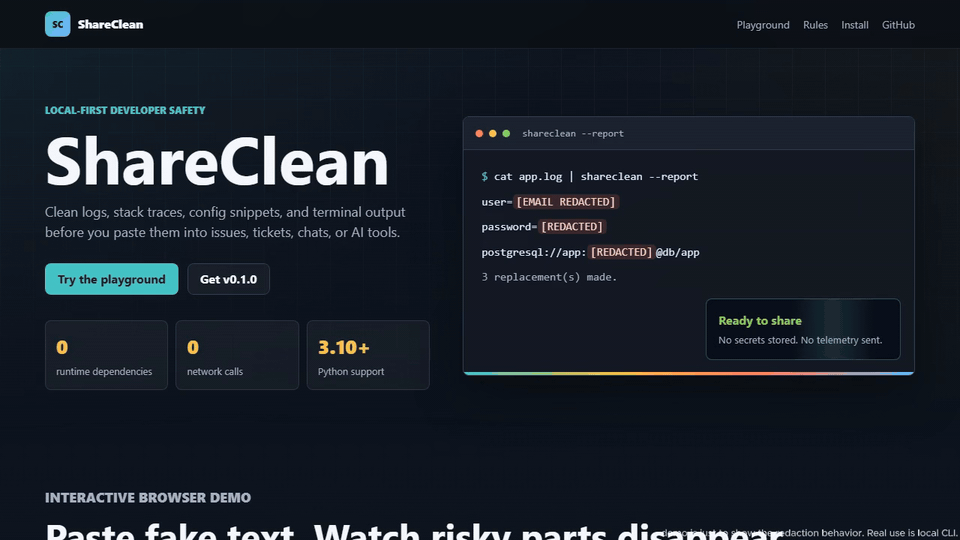

# ShareClean

[](https://github.com/OmarH-creator/ShareClean/actions/workflows/ci.yml)


[](https://github.com/OmarH-creator/ShareClean/releases)
[](https://omarh-creator.github.io/ShareClean/)

Local-first Python CLI for sanitizing logs, stack traces, config snippets, and terminal output before you paste them into GitHub issues, support tickets, Slack, or AI chats.

ShareClean detects common sensitive values, replaces only the risky portion, and reports safe metadata without storing or printing the original secret. It makes no network calls and sends no telemetry.

[Try the interactive browser playground](https://omarh-creator.github.io/ShareClean/) to see the redaction rules before installing.



Browser playground shown for illustration; real workflows run locally through the CLI.

## Install

With `pipx`:

```bash
pipx install shareclean
```

From a local checkout:

```bash
python -m pip install -e .
```

Run without installing from the repository root:

```bash
python -m shareclean --help
```

## Quick Start

```bash
shareclean app.log
shareclean app.log --output app.cleaned.log
shareclean app.log --report
shareclean app.log --report --report-format json
shareclean app.log --check
shareclean app.log --check --fail-on severity:high
shareclean app.log --check --fail-on category:token,rule:SC004
shareclean app.log --check --ignore-for-check category:pii_email
```

`--check` exits `1` only for findings selected by the check policy and never writes sanitized text to stdout.

Configured `fail_on` and `ignore_for_check` policies from config files, profiles, or environment variables apply only in `--check` mode. Normal sanitization still redacts and reports findings, but those policies do not change the exit decision unless `--check` is present.

## Configuration

ShareClean supports committed project policy in either `pyproject.toml` or `.shareclean.toml`.

```toml
[tool.shareclean]
redact_email = true
redact_private_ip = false
redaction_label = "[REDACTED]"
profile = "default"

[tool.shareclean.profiles.ci]
redact_email = true
redact_private_ip = true
fail_on = ["severity:high"]
```

For `.shareclean.toml`, omit the `tool.shareclean` prefix:

```toml
redact_email = true
redact_private_ip = false

[profiles.ci]
redact_private_ip = true
fail_on = ["severity:high"]
```

Config location:

1. `--config PATH`
2. Nearest project directory containing `.shareclean.toml` or a `pyproject.toml` with `[tool.shareclean]`
3. Defaults

Auto-discovery walks upward from the current directory until the Git root or filesystem root. It uses only the nearest config directory and never merges parent configs. If `.shareclean.toml` and ShareClean config in `pyproject.toml` exist in the same selected directory, ShareClean exits `2`.

Config precedence:

1. CLI flags
2. Environment variables
3. Selected profile values
4. Base project config
5. Defaults

Environment variables:

- `SHARECLEAN_REDACT_EMAIL`
- `SHARECLEAN_REDACT_PRIVATE_IP`
- `SHARECLEAN_REDACTION_LABEL`
- `SHARECLEAN_PROFILE`
- `SHARECLEAN_FAIL_ON`
- `SHARECLEAN_IGNORE_FOR_CHECK`

Boolean environment values accept `true`, `1`, `yes`, `on`, `false`, `0`, `no`, and `off`.

Inspect effective configuration without reading input:

```bash
shareclean config show
```

## Detection Rules

| Rule ID | Detector | Category | Severity |
|---|---|---|---|
| `SC001` | Key-value secret | `credential` | `high` |
| `SC002` | Bearer token | `token` | `high` |
| `SC003` | JWT-like token | `token` | `high` |
| `SC004` | Connection-string password | `connection_string` | `critical` |
| `SC005` | Email address | `pii_email` | `medium` |
| `SC006` | Local user path | `pii_path` | `medium` |
| `SC007` | Private IP address | `internal_network` | `medium` |
| `SC008` | PEM private-key block | `private_key` | `critical` |

Private IP detection is off by default; enable it with `--redact-private-ip` or config.

When detectors overlap on the same text range, ShareClean emits one finding using the highest-severity rule. If severities match, it uses the most specific detector.

## JSON Reports

JSON reports use schema version `1.0` and do not include filenames, paths, matched values, hashes, source snippets, or masked previews.

```json
{
  "schema_version": "1.0",
  "source": "file",
  "summary": {
    "findings": 1,
    "by_category": {
      "credential": 1
    },
    "by_severity": {
      "high": 1
    }
  },
  "findings": [
    {
      "rule_id": "SC001",
      "category": "credential",
      "severity": "high",
      "location": {
        "start": {
          "line": 1,
          "column": 10
        },
        "end": {
          "line": 1,
          "column": 27
        }
      },
      "replacement": "[REDACTED]"
    }
  ]
}
```

Locations are 1-based. End positions are exclusive. Columns count Unicode code points after treating CRLF as one LF newline for location purposes.

## CLI Reference

```text
usage: shareclean [-h] [--version] [--check] [--output FILE] [--report]
                  [--report-format {text,json}] [--config FILE]
                  [--profile NAME] [--redact-email] [--no-redact-email]
                  [--redact-private-ip] [--no-redact-private-ip]
                  [--redaction-label TEXT] [--fail-on SELECTORS]
                  [--ignore-for-check SELECTORS]
                  [FILE]
```

`--no-email` remains as a deprecated alias for `--no-redact-email`.

Exit codes:

| Code | Meaning |
|---:|---|
| `0` | Completed successfully |
| `1` | Selected findings detected in `--check` mode |
| `2` | User, I/O, config, or selector error |
| `3` | Unexpected internal error |

## Safety Model

ShareClean is intentionally local and transparent:

- No network calls
- No cloud processing
- No telemetry
- No account or API key required
- Original matched secret values are not stored in findings or reports
- Input files are never modified in place

## Coverage And Limitations

ShareClean is pattern-based. It can miss unusual formats and can redact benign text that resembles a secret. It is not a replacement for repository secret scanners, source-history scanning, or DLP systems.

The test corpus under `tests/fixtures/` uses only fake values and is split into generic, cloud, database, CI/CD, SaaS, log, YAML/JSON/env, and false-positive packs. Bug reports that change detection should add a regression fixture using clearly fake data.

## Development

Run the test suite:

```bash
python -m unittest discover -s tests -v
```

Run packaging checks:

```bash
python -m compileall -q src tests
python -m build
python -m twine check dist/*
```

## License

ShareClean is released under the [MIT License](LICENSE).
